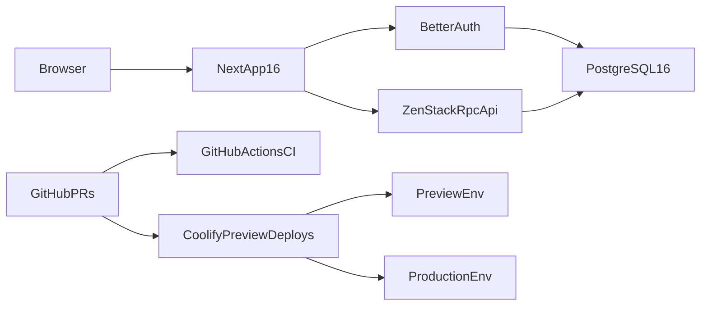

# Greenfield SaaS Template

## Scope And Assumptions

- Start from the current empty workspace as a greenfield repo.
- Use a single root Next.js app instead of a monorepo.
- Use `yarn` everywhere for install, scripts, and CI.
- Use Doppler as the single source of truth for environment variables across local development, CI, preview, and production.
- Use Coolify native preview deployments for pull requests; keep GitHub Actions focused on CI and optional image publishing.

## Architecture

## Foundation

- Bootstrap a strict TypeScript Next.js 16.1 App Router app in the repo root with `[package.json](package.json)`, `[tsconfig.json](tsconfig.json)`, `[next.config.ts](next.config.ts)`, `[src/app/layout.tsx](src/app/layout.tsx)`, and `[src/app/page.tsx](src/app/page.tsx)`.
- Pin runtime expectations with `[.nvmrc](.nvmrc)` and document Node `20.9+` plus `yarn` usage in `[README.md](README.md)`.
- Add typed environment handling in `[src/lib/env.ts](src/lib/env.ts)` so Doppler-injected auth, database, email, and deployment settings fail fast.
- Add `[doppler.yaml](doppler.yaml)` and documented `doppler setup` / `doppler run` workflows so the repo has one consistent env-loading path on every machine.
- Add a root `[Makefile](Makefile)` as the main orchestration entrypoint for local development and CI-friendly commands, wrapping `yarn`, `docker compose`, `doppler run`, ZenStack codegen, auth migrations, and test commands behind stable targets.

## UI And Client Architecture

- Initialize shadcn/ui and Tailwind, then create a small design-system baseline in `[src/components/ui](src/components/ui)` and shared app-shell pieces in `[src/components/layout](src/components/layout)`.
- Add `[src/app/providers.tsx](src/app/providers.tsx)` for TanStack Query and theme providers.
- Standardize forms with React Hook Form + Zod and tables with TanStack Table so the first CRUD screens are generated on top of reusable primitives instead of ad hoc components.

## Data Layer And Auth

- Make `[zenstack/schema.zmodel](zenstack/schema.zmodel)` the source of truth for application data and access rules.
- Generate ZenStack runtime artifacts plus the frontend-safe lite schema so typed TanStack Query hooks can be consumed without exposing policies; keep generated output under a dedicated folder such as `[src/lib/zenstack](src/lib/zenstack)`.
- Expose ZenStack RPC CRUD endpoints through `[src/app/api/model/[...path]/route.ts](src/app/api/model/[...path]/route.ts)` so CRUD stays schema-driven and type-safe end to end.
- Set up Better Auth in `[src/lib/auth.ts](src/lib/auth.ts)`, `[src/lib/auth-client.ts](src/lib/auth-client.ts)`, and `[src/app/api/auth/[...all]/route.ts](src/app/api/auth/[...all]/route.ts)` using PostgreSQL via `pg`.
- Isolate Better Auth tables into a dedicated PostgreSQL schema such as `auth` while leaving ZenStack-managed app data in the default application schema. This avoids table ownership conflicts and matches Better Auth's documented `search_path` support.
- Use `[src/proxy.ts](src/proxy.ts)` only for optimistic redirects and keep real authorization checks in server components, route handlers, and ZenStack policies.
- Seed the template with generic multi-tenant starter models in `[zenstack/schema.zmodel](zenstack/schema.zmodel)`: `User`, `Organization`, `Membership`, and one example business entity such as `Project` so the repo demonstrates auth + tenant scoping + CRUD without locking into a specific SaaS domain.

## Testing Strategy

- Add Vitest + React Testing Library config in `[vitest.config.mts](vitest.config.mts)` and `[src/test/setup.ts](src/test/setup.ts)` for unit tests around utilities, forms, and client components.
- Add Playwright config in `[playwright.config.ts](playwright.config.ts)` and initial end-to-end coverage in `[tests/e2e](tests/e2e)` for sign-up/sign-in, protected dashboard access, and CRUD on the example `Project` entity.
- Keep async Server Component behavior primarily covered by Playwright, which aligns with current Next.js guidance.

## Local Dev And Deployment

- Add `[Dockerfile](Dockerfile)` and `[.dockerignore](.dockerignore)` for a multi-stage production image.
- Add `[docker-compose.yml](docker-compose.yml)` for Docker-first local development with the app, PostgreSQL 16, and any required support services.
- Make local development runnable with one command via a Make target such as `make dev`, backed by `docker compose up` or `docker compose watch`, with the app container using Doppler to inject environment variables. Keep an optional non-Docker path documented for contributors who prefer native Node.
- Keep production and preview deployments in Coolify as app deployments plus a dedicated PostgreSQL resource/service, not a single tightly coupled Compose preview stack. This avoids the container-name coupling problems called out in Coolify preview-deploy docs.
- Configure Coolify preview deployments with a wildcard preview domain, GitHub App integration, and preview-only Doppler configs or scoped secrets. Production secrets stay isolated from PR previews.

## CI/CD

- Add `[.github/workflows/ci.yml](.github/workflows/ci.yml)` for `yarn install`, typecheck, lint, Vitest, and Next build on pushes and pull requests, with secrets injected through Doppler.
- Add `[.github/workflows/e2e.yml](.github/workflows/e2e.yml)` for Playwright against a disposable test database service.
- Only add image publish steps if they materially improve deployment flow; with Coolify native previews, Docker image building is optional rather than the primary preview mechanism.

## Documentation And DX

- Write a setup guide in `[README.md](README.md)` covering Doppler project/config setup, Makefile targets, one-command Docker local boot, ZenStack codegen, Better Auth schema generation/migration, test commands, and Coolify preview deployment setup.
- Include one short architecture section in `[README.md](README.md)` explaining that Next.js server code, Better Auth, and ZenStack share the same TypeScript types and the same PostgreSQL backend.

## Docs Used

- Next.js 16 App Router and testing docs
- shadcn/ui installation docs
- Better Auth Next.js and PostgreSQL adapter docs
- ZenStack 3.x TanStack Query and 3.x guide entry points
- Coolify GitHub preview deployment docs
- Playwright and Vitest current version/docs references from web search results

